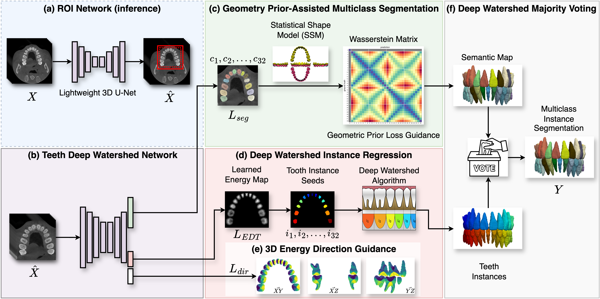
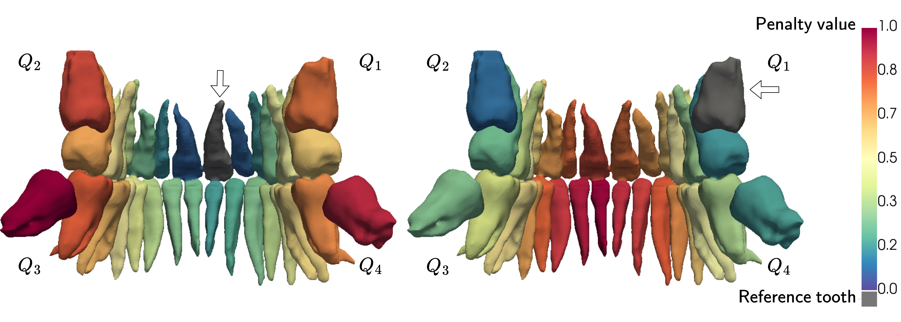
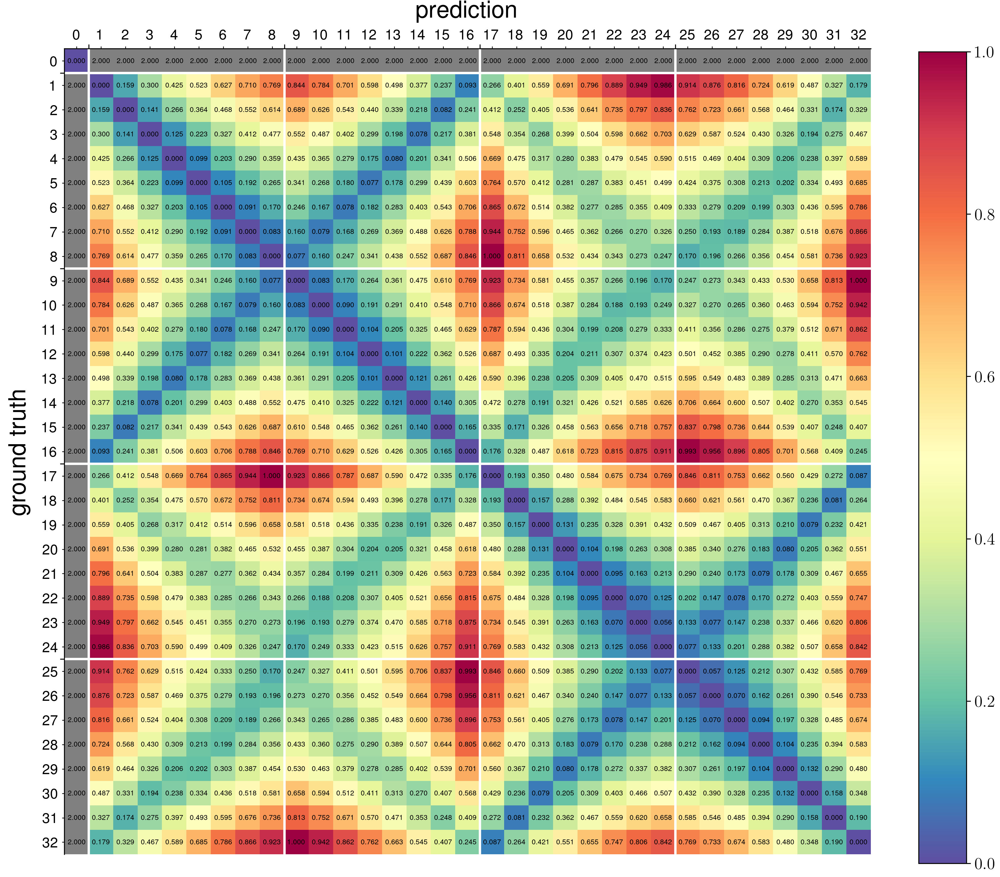
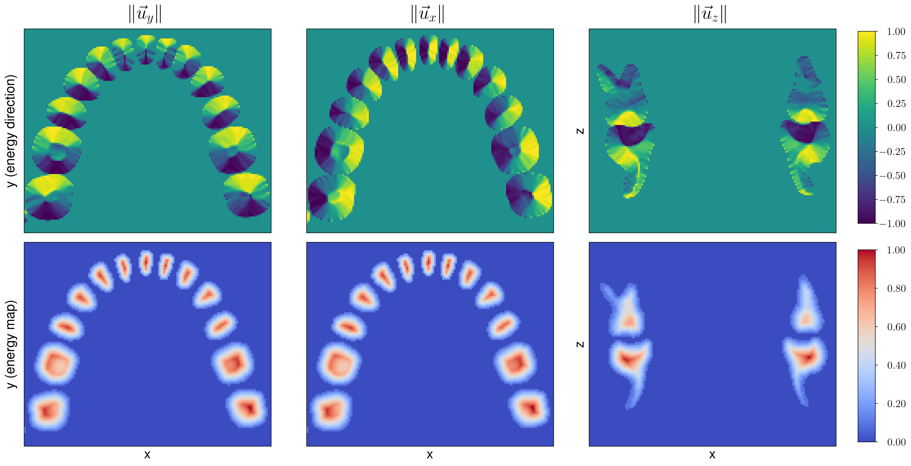

# GEPAR3D: Geometry Prior-Assisted Learning for 3D Tooth Segmentation

[](https://arxiv.org/pdf/2508.00155)  [](https://tomek1911.github.io/GEPAR3D/) [](https://zenodo.org/records/15739014) [](https://drive.google.com/drive/folders/1CqqLdaJSA9bT1whKnUvPfax654psx9YE?usp=drive_link) [](https://papers.miccai.org/miccai-2025/0375-Paper1833.html)

This is the official code for "GEPAR3D: Geometry Prior-Assisted Learning for 3D Tooth Segmentation" accepted for the 28th International Conference on Medical Image Computing and Computer Assisted Intervention - MICCAI 2025, Daejeon, Republic of Korea.
s
---


Tooth segmentation in Cone-Beam Computed Tomography (CBCT) remains challenging, especially for fine structures like root apices, which is critical for assessing root resorption in orthodontics. We introduce `GEPAR3D`, a novel approach that unifies instance detection and multi-class segmentation into a single step tailored to improve root segmentation. Our method integrates a Statistical Shape Model of dentition as a geometric prior, capturing anatomical context and morphological consistency without enforcing restrictive adjacency constraints. We leverage a deep watershed method, modeling each tooth as a continuous 3D energy basin encoding voxel distances to boundaries. This instance-aware representation ensures accurate segmentation of narrow, complex root apices. Trained on publicly available CBCT scans from a single center, our method is evaluated on external test sets from two in-house and two public medical centers. `GEPAR3D` achieves the highest overall segmentation performance, averaging a Dice Similarity Coefficient (DSC) of 95.0% (+2.8% over the second-best method) and increasing recall to 95.2% (+9.5%) across all test sets. Qualitative analyses demonstrated substantial improvements in root segmentation quality, indicating significant potential for more accurate root resorption assessment and enhanced clinical decision-making in orthodontics.



## We obtained improved sensitivity to root apices
Existing methods struggle to segment accurately root apices, crucial for toot resporption assesment and treatment planning. We present qualitative comparison of GEPAR3D with the two best-performing methods. Surface Hausdorff Distance heatmaps are overlaid on GT labels (greend = low, purple = high) highlight apex deviations. GEPAR3D shows superior root sensitivity versus tooth-specific baselines. Missing teeth are shown in gray. 


## We leverage geometric prioir based on Satistical Shape Model of normal dentition
We present intermediate step in the computation of the Wasserstein loss, where penalties are assigned to each class based on the Wasserstein distance from a designated references tooth. A 3D heatmap visualization, overlaid on the segmentation GT label, is shown for two different reference teeth (indicated by arrows and gray overlays). The highest misclassification penalties correspond to teeth that are both morphologically dissimilar and spatially distant from the reference.




## We adapt 3D Deep Watershed towards stronger morpogological inductive bias - morphology-informed energy learning in 3D.
We present Energy Map in the axial (xy) plane. A representative slice from the 3D scan is shown, selected near the contact points where adjacent tooth crowns exhibit close anatomical proximity. This region, characterized by broad interproximal contact and parallel axial walls, presents a challenging condition for separating anatomically congruent and tangentially aligned teeth. The energy map highlights the model’s ability to resolve individual instances despite the absence of clear interproximal gaps or distinct morphological transitions between adjacent crowns. 



### Data
Datasets related to this paper:
- https://zenodo.org/records/15739014 - GEPAR3D T.Szczepański et al.
- https://www.nature.com/articles/s41467-022-29637-2  - Z.Cui et al.
- https://ditto.ing.unimore.it/toothfairy2/ - F.Bolelli et al.


### Source code details

- configs/data_split.json - exact patient IDS used for evaluation
- configs/experiment_config.yaml - configuration for experiments: table 1 and table 2
- configs/requirements.yaml - conda environment configuration
- configs/roi_binary_coarse_segmentation.yaml - configuration for ROI preprocessing coarse UNet, binary segmentation
- configs/geometric_prior_multitask.yaml - configuration for GEPAR3D method
- scripts/ablation_study/train.py - script to train all experiments of ablation study, including proposed solution
- scripts/ablation_study/inference.py - script to run inference of models within ablation study, including proposed solution
- scripts/general_segmentation_methods/train.py - script to train all general segmentation methods, table 1

### Prerequisites
Ensure you have the following installed:
- Miniconda or Anacondas
- NVIDIA GPU with CUDA 11 support 
- Python 3.9


#### Create and Activate a Conda Environment
```
conda env create -f requirements.yaml -n gepar3d
conda activate gepar3d
```

#### Training

To train the model, follow these steps:

1. **Preprocessed Data**\
  Obtain annotated labels of dataset from GEPAR3D Zenodo and scans from Z.Cui et al. Structure data properly in folders. Generate required assets with scripts in ```src/generate_data```.      
3. **Run Training**\
   Once the data is prepared, start the required training process. To train `GEPAR3D` method run ```scripts/ablation_study/train.py```. The configuration yaml files are by deafult the proposed solution.


#### Inference

To run inference, one can use the provided checkpoints or train them oneself. To run full pipeline leverage ROI binary segmentation and multi-class GEPAR3D method: ```scripts/ablation_study/inference.py```.